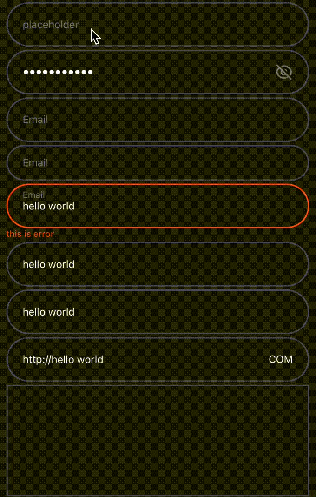

# XButton

<p align="center">
  
</p>

## Code
```tsx
<XButton
  type={'confirm'}
  title="confirm"
  titleClassName={'text-[white] !text-[30px]'}
  className="bg-[red]"
  onPress={_onPress}
/>
<XButton
  title="Click"
  type={'pink'}
  style={{ flexDirection: 'row', borderRadius: 0 }}
>
  <Text>hhh</Text>
</XButton>
<XButton
  title="Click"
  type={'pink'}
  size={'large'}
  loading
  loadingSize={25}
  loadingWeight={6}
  loadingVariant={'white'}
/>
<XButton
  title="Click"
  type={'pink'}
  size={'large'}
  disabled
  icon={<IconLogo />}
  iconAlign={'right'}
/>
```

## API Reference
prop  | type | default 
---|---|---
type | `ButtonType` | text |
size |  `ButtonSize` | large
disabled | `boolean` |  -
title | `string` | -
titleAlign | `enum` | right
loading | `boolean` | -
loadingSize | `number` | 16
loadingWeight | `number` | -
loadingVariant | `LoadingVariant` | -
icon | `ReactElement` | -
iconAlign | `enum` | right
style | `StyleProp<ViewStyle>` | -
disabledStyle | `StyleProp<ViewStyle>` | -
titleStyle | `StyleProp<TextStyle>` | -
disabledTitleStyle | `StyleProp<TextStyle>` | -


# XCheckbox
<p align="center">
  
</p>

## Code
```tsx
<XCheckbox
  activeColor={'#7DD5F9'}
  color="#9598B9"
  iconColor="#0a1161"
  size={40}
/>
```

## API Reference
prop  | type | default 
---|---|---
value | `boolean` | -
disabled| `boolean` | -
color| `string` | -
activeColor| `string` | -
iconColor| `string` | -
size| `number` | -
style | `StyleProp<ViewStyle>` | -

# XCollapsible
<p align="center">
  
</p>

## BASE
```tsx
//example1
<XCollapsible
  title="Title"
  contentStyle={{ paddingVertical: 30, backgroundColor: '#fefefe' }}
>
  <Text>hello world</Text>
</XCollapsible>

//example2
<XCollapsibleGroup unique>
  <XCollapsible
    title="Title 1"
    contentStyle={{ paddingVertical: 30, backgroundColor: '#fefefe' }}
  >
    <Text>hello world</Text>
  </XCollapsible>
  <XCollapsible
    title="Title 2"
    contentStyle={{ paddingVertical: 30, backgroundColor: '#fefefe' }}
  >
    <Text>hello world</Text>
  </XCollapsible>
</XCollapsibleGroup>
```

## API Reference
prop  | type | default 
---|---|---
title | `string` / `JSX.Element` | -
style? | `StyleProp<ViewStyle>` | -
titleStyle | `StyleProp<ViewStyle`> | -
activeTitleStyle | `StyleProp<ViewStyle>` | -
textStyle | `StyleProp<TextStyle>` | -
contentStyle | `StyleProp<ViewStyle` | -

# XCutCornerTip
<p align="center">
  
</p>

## Code
```tsx
<XCutCornerTip
  title="hello world"
  theme={'xpink'}
  cornerDirection={'top-left'}
/>
```

## API Reference
prop  | type | default 
---|---|---
title | `string` | -
theme | `enum -> xcyan,xpink` | xcyan
bgColor | `string`| -
textColor | `string` | -
corner | `number` | 10
cornerDirection | `CornerDirectionType` | bottom-right
cornerAxis | `enum -> x,y` | x
style |`StyleProp<ViewStyle>` | -
textStyle | `StyleProp<TextStyle>` | -


# XGradientText
<p align="center">
  
</p>

## Code
```tsx
<XGradientText colors={['red', 'blue']} direction={'to bottom'}>
  HELLO WORLD
</XGradientText>
```

## API Reference
prop  | type | default 
---|---|---
numberOfLines | `number` | -
text | `string` | -
colors | `string[]` | `['#9EE6FC', '#EBB9E7']`
direction | `GradientDirectionType` | `to right`
fontSize | `number` | 14
fontWeight | `TextStyle['fontWeight']`| -
fontStyle | `TextStyle['fontStyle']`| -
fontFamily| `TextStyle['fontFamily']` | -
style | `StyleProp<TextStyle>`| -


# XGradientCard
<p align="center">
  
</p>

## Code
```tsx
<View style={{ position: 'relative' }}>
  <XGradientCard absolute />
  <Text className="text-white">hello world</Text>
  <Text className="text-white">hello world</Text>
  <Text className="text-white">hello world</Text>
</View>
<XGradientCard>
  <Text className="text-white">hello world</Text>
  <Text className="text-white">hello world</Text>
</XGradientCard>
<XGradientCard
  style={{ width: '100%', height: 100 }}
  colors={['red', 'blue']}
  direction={'to right'}
  strokeWidth={5}
  corner={{ x: 20, y: 40 }}
  cornerDirection={'bottom-right'}
  radius={5}
  backgroundColors={['red', 'cyan']}
  backgroundDirection={'to bottom'}
/>
<XGradientCard
  style={{ width: '100%', height: 100 }}
  corner={{ x: 20, y: 40 }}
  cornerDirection={['top-left', 'bottom-right']}
  radius={25}
  img={'https://picsum.photos/seed/696/3000/2000'}
/>
```

## API Reference
prop  | type | default 
---|---|---
strokeWidth|`number`| 2
fill| `string`| `none`
stroke| `string`|`none`
radius| `number`| 0
background| `boolean`| -
corner | `number`/ `{ x: number; y: number }` | 0
cornerDirection |`CornerDirectionType`/`CornerDirectionType[]`| `bottom-right`
colors | `string[]` | `['#9EE6FC', '#EBB9E7']`
direction| `GradientDirectionType`| `to right`
backgroundColors| `string[]` | `[]`
backgroundDirection |`GradientDirectionType` | `to left`
img| `string`/`ImageProps['source']`| -
absolute | `boolean` | -
style | `StyleProp<ViewStyle>` | -

# XImage
<p align="center">
  
</p>

## Code
```tsx
<XImage
  source={require('../assets/example.jpg')}
  style={{ width: 80, height: 80 }}
/>
<XImage
  source={{ uri: 'https://picsum.photos/seed/696/3000/2000' }}
  style={{ width: 80, height: 80 }}
  contentPosition={'right'}
/>
<XImage
  source={'https://picsum.photos/seed/696/3000/2000'}
  style={{ width: 80, height: 80 }}
  blurRadius={200}
/>
```

## API Reference
prop  | type | default 
---|---|---
source | `ImageSource`/`string`/`ImageRequireSource` | -
placeholder | `ImageSource`/`string`/`ImageRequireSource` | -
height | `number` | -
width | `number` | -
contentFit | `ImageContentFit` | `cover`
placeholderContentFit | `ImageContentFit` | -
contentPosition | `ImageContentPosition` | -
blurRadius | `number` | -
transition | `ImageTransition`/ `number` | 500
style | `StyleProp<ViewStyle>` | -

# XInput
<p align="center">
  
</p>

## Code
```tsx
<XInput placeholder={'placeholder'} multiline readOnly/>
<XInput label="Email" value="hello world" errorMsg="this is error" />
<XInput
  value="hello world"
  prefixComp={
    <Text style={{ alignSelf: 'center', color: 'white' }}>http://</Text>
  }
  suffixComp={
    <Text style={{ alignSelf: 'center', color: 'white' }}>COM</Text>
  }
/>
```

## API Reference
prop  | type | default 
---|---|---
label | `string` | -
theme| `dark`/`normal` | `normal`
errorMsg | `string` | -
showPassword | `boolean` | -
showClear | `boolean` | -
disabled| `boolean`|-
cursorColor | `string` | -
placeholderTextColor | `string` | -
value | `string` | -
multiline | `boolean`|-
style | `StyleProp<ViewStyle>` | -
containerStyle | `StyleProp<ViewStyle>` | -
inputTextStyle | `StyleProp<TextStyle>` | -
suffixComp | `ReactNode` | -
prefixComp | `ReactNode` | -
onFocus| `function` | -
onBlur| `function` | -
onChange| `function` | -
onClear| `function` | -

# XInputCounter
<p align="center">
  
</p>

## Code
```tsx
<XInputCounter
  type={'float'}
  value={5.40}
  inputTextStyle={{ fontSize: 20 }}
/>
<Margin />
<XInputCounter
  step={2}
  min={1}
  max={10}
  inputTextStyle={{ fontSize: 20 }}
/>
```

## API Reference
prop  | type | default 
---|---|---
value | `number` | 1
defaultValue | `number` | 1
min| `number`| -
max| `number` | -
step| `number` | 1
type| `int`/`float` | `int`
style| `StyleProp<ViewStyle>` | -
iconSize| `number` | -
iconColor| `string` | `#9598B9`
iconDisabledColor| `string` | `#9598B966`
disabled | `boolean`| -
style | `StyleProp<ViewStyle>` | -
containerStyle | `StyleProp<ViewStyle>` | -
inputTextStyle | `StyleProp<TextStyle>` | -
onChange | `function` | -

# XInputRange
<p align="center">
  
</p>

## Code
```tsx
<XInputRange
  values={[1.5, 2.5]}
  type="float"
  onChange={(p) => {
    console.log('input range:', p);
  }}
/>
<XInputRange
  min={1}
  max={100}
  onChange={(p) => {
    console.log('input range:', p);
  }}
/>
```

## API Reference
prop  | type | default 
---|---|---
values | `[number, number]` | 1
min| `number`| 0
max| `number` | -
type| `int`/`float` | `int`
theme| `dark`/`normal` | `normal`
leftPlaceholder | `string` | -
rightPlaceholder | `string` | -
style | `StyleProp<ViewStyle>` | -
containerStyle | `StyleProp<ViewStyle>` | -
inputTextStyle | `StyleProp<TextStyle>` | -
onFocus| `function` | -
onBlur| `function` | -
onChange| `function` | -

# XLoading
<p align="center">
  
</p>

## Code
```tsx
<XLoading size={60} weight={5} variant={'color'} withLogo />
<XLoading logo={<Text>A</Text>} withLogo />
<XLoading backColor="red" frontColor="yellow" logoColor="blue" withLogo />
```

## API Reference
prop  | type | default 
---|---|---
size | `number` | 40
withLogo | `boolean` | -
variant | `LoadingVariant -> white,blue,pink,lightblue,cyan,color` | `pink`
weight | `number` | 3
backColor | `string` | -
logoColor | `string` | -
frontColor | `string` | -
logo | `ReactElement` | -
style | `StyleProp<ViewStyle>` | -

# XMultiText
<p align="center">
  
</p>

## Code
```tsx
<XMultiText numberOfLines={3}>
  Woke up in the morning breeze, met the sun, there is a melting warmth
</XMultiText>
<XMultiText numberOfLines={3} variant={'bottom'}>
  Woke up in the morning breeze, met the sun, there is a melting warmth
</XMultiText>
<XMultiText
  numberOfLines={3}
  textColor={'red'}
  moreTextColor={'red'}
  moreBgColors={['yellow', 'orange']}
  moreTitle={'展开'}
  lessTitle={'收起'}
>Woke up in the morning breeze, met the sun, there is a melting warmth</XMultiText>
<XMultiText
  numberOfLines={3}
  renderMore={(p) => (
    <Text className="text-[yellow]">{p ? '查看更多' : '收起'}</Text>
  )}
>Woke up in the morning breeze, met the sun, there is a melting warmth</XMultiText>

```

## API Reference
prop  | type | default 
---|---|---
numberOfLines | `number`|0
variant| `hover`/ `bottom`|`hover`
textColor| `string`| `#fefefe`
moreTitle| `string`| -
lessTitle| `string`|-
moreTextColor| `string`|-
moreBgColors | `string[]`|`['#14143000 0%', '#141430 30%']`
renderMore| `() => JSX.Element`|-
style| `StyleProp<TextStyle>`|-
moreStyle| `StyleProp<ViewStyle>`|-

# XPager
<p align="center">
  
</p>

## Code
```tsx
<XPager
  count={20}
  onPageChange={(p) => {
    console.log('the page number is:', p);
  }}
  textColor="red"
  selectTextColor="white"
  itemStyle={{ width: 24, height: 24 }}
  page={5}
/>
```

## API Reference
prop  | type | default 
---|---|---
count|`number`|-
page| `number`|-
onPageChange|`function`| - 
textColor| `string`|`#fefefe`
selectTextColor| `string`|`#141430`
style| `StyleProp<ViewStyle>`|-
itemStyle| `StyleProp<ViewStyle>`|-
selectItemStyle| `StyleProp<ViewStyle>`|-
arrowStyle| `StyleProp<ViewStyle>`|-


# XPopOver
<p align="center">
  
</p>

## Code
```tsx
//example1
<XPopOver
  place={'bottom-start'}
  triggerStyle={{ width: 200 }}
  trigger={
    <View style={{ backgroundColor: 'blue', height: 50 }}>
      <Text className="text-[#fefefe]">This is popover trigger</Text>
    </View>
  }
  contentStyle={{ width: 300, height: 300 }}
  showArrow={true}
  offset={10}
  arrowSize={10}
>
  <Text className="text-[#fefefe]">This is content</Text>
</XPopOver>

//example2
<XButton
  title="this is outside popover trigger"
  type={'white'}
  onPress={() => setIsOpen0(true)}
  innerRef={_triggerRef}
/>
<XPopOver
  triggerRef={_triggerRef}
  isOpen={isOpen0}
  onClose={() => setIsOpen0(false)}
  contentStyle={{ width: 300, height: 300 }}
  place={'bottom'}
  showArrow={true}
  offset={10}
  bgColor="red"
>
  <Text className="text-[#fefefe]">This is content</Text>
</XPopOver>
```

## API Reference
prop  | type | default 
---|---|---
isOpen  | `boolean` | -
onClose |  `function` | -
place | `PlacementEnum-> bottom,top,left,right,bottom-start,bottom-end,top-start,top-end` | `bottom-start`
trigger | `ReactNode` | -
triggerEnable | `boolean` | `true`
triggerRef | `RefObject<View>` | -
theme | `light`/ `dark` | `dark`
bgColor | `string` | -
offset | `number` | 0
showArrow | `boolean` | `true`
arrowSize | `number` | 6
contentStyle | `StyleProp<ViewStyle>` | -
triggerStyle | `StyleProp<ViewStyle>` | -
arrowStyle | `StyleProp<ViewStyle>`|-
contentWidth | `number` | 300

# XToolTip
<p align="center">
  
</p>

## Code
```tsx
<XToolTip
  text={`Woke up in the morning breeze, met the sun...`}
  textStyle={{ color: 'red' }}
  triggerStyle={{ backgroundColor: 'blue' }}
/>
<XToolTip
  text={`Woke up`}
  bgColor="red"
  trigger={
    <Text className="text-[#ffffff]">This is tooptip custom button</Text>
  }
/>
```

## API Reference
prop  | type | default 
---|---|---
text | `string` | -
textStyle | `StyleProp<TextStyle>` | -
...PopOverProps


# XToolTip
<p align="center">
  
</p>

## Code
```tsx
<XToolTip
  text={`Woke up in the morning breeze, met the sun...`}
  textStyle={{ color: 'red' }}
  triggerStyle={{ backgroundColor: 'blue' }}
/>
<XToolTip
  text={`Woke up`}
  bgColor="red"
  trigger={
    <Text className="text-[#ffffff]">This is tooptip custom button</Text>
  }
/>
```

## API Reference
prop  | type | default 
---|---|---
text | `string` | -
textStyle | `StyleProp<TextStyle>` | -
...PopOverProps
